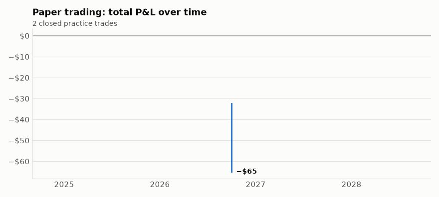
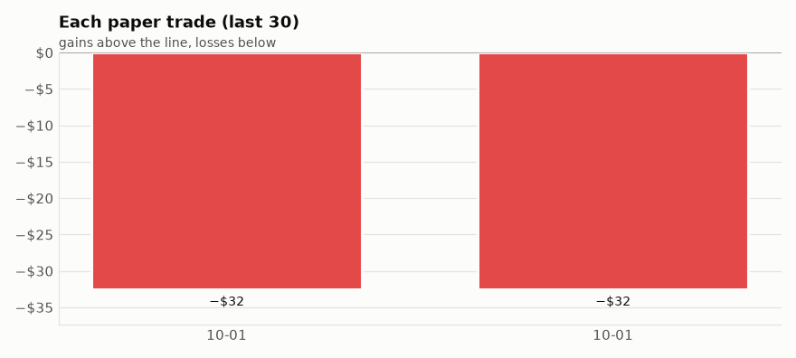
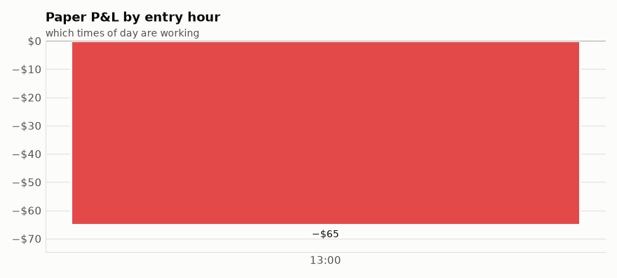

# Paper Trading Journal
_Practice trades only, no real money. Written automatically by the bot. Last update: 2026-10-01 19:10 UTC_

## Scoreboard

| Closed trades | Winners | Win rate | Total P&L | Avg per trade | Avg win | Avg loss | Best | Worst | Worst drawdown | Open now |
|---|---|---|---|---|---|---|---|---|---|---|
| 2 | 0 | 0% | $-65.00 | $-32.50 | - | $-32.50 | $-32.50 | $-32.50 | $-32.50 | 0 |

_Judge it after 20+ closed trades. A handful of results is mostly luck._

## Charts

## Trade review: which specialists were right on its own trades

Starts at 30 reviewed trades (2 so far). From 50, the self-tuner tests a team of the specialists that did best here.

## Open paper trades

_None._

## Closed paper trades (newest first)

| Date | Time | Source | Contract | Expires | Paid | Exit | Highest | P&L | P&L % | How it ended |
|---|---|---|---|---|---|---|---|---|---|---|
| 2026-10-01 | 13:30 | intraday | SPY 743 put | 2026-10-08 | $0.98 | $0.66 | $0.98 | $-32.50 | -33% | close |
| 2026-10-01 | 13:30 | intraday | SPY 743 put | 2026-10-08 | $0.98 | $0.66 | $0.98 | $-32.50 | -33% | close |

## By month

| Month | Trades | Winners | Win rate | P&L |
|---|---|---|---|---|
| 2026-10 | 2 | 0 | 0% | $-65.00 |

## By how the trade ended

| Exit | Trades | Win rate | P&L | Avg |
|---|---|---|---|---|
| close | 2 | 0% | $-65.00 | $-32.50 |

## Morning signal vs later in the day

| Source | Trades | Win rate | P&L | Avg |
|---|---|---|---|---|
| intraday | 2 | 0% | $-65.00 | $-32.50 |

## By entry hour

| Entered | Trades | Win rate | P&L | Avg |
|---|---|---|---|---|
| 13:00 hour | 2 | 0% | $-65.00 | $-32.50 |

## Strongest signals vs the rest

| Signal strength | Trades | Win rate | P&L | Avg |
|---|---|---|---|---|
| strong (would-be real alert) | 0 | - | $+0.00 | - |
| normal (paper only) | 2 | 0% | $-65.00 | $-32.50 |

## Calls vs puts

| Type | Trades | Win rate | P&L | Avg |
|---|---|---|---|---|
| put | 2 | 0% | $-65.00 | $-32.50 |

## What the exits mean
- **stop**: fell to the $-stop you set
- **trail stop**: had risen, then fell back to the raised stop (profit or breakeven locked in)
- **target**: hit a fixed take-profit (only if one is set)
- **close**: sold at the end-of-day close-out
- **missed close**: the closing run didn't happen, closed at the next morning's check
