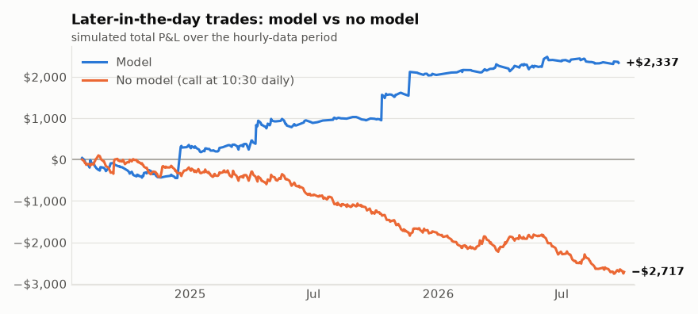
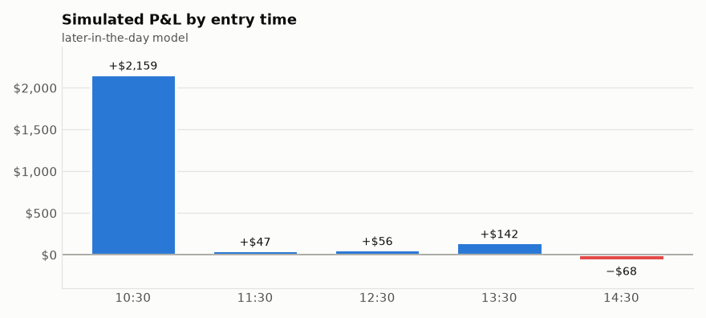
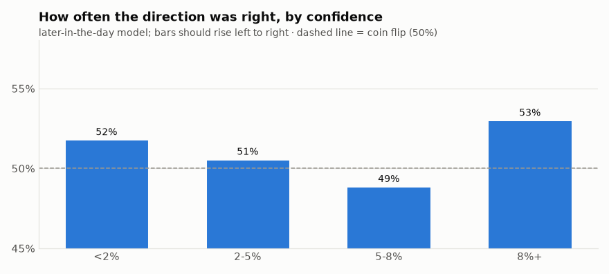

# SPY model backtest - 2026-10-02

Tested 2011-10-20 to 2026-09-30 (3757 days), model = logistic, prediction = SPY closes above the open by today's close, edge threshold = 0.08.

## Does the model predict direction?
- AUC: **0.498** (0.50 = coin flip; below ~0.53 is not a usable edge)
- SPY closed above the open by today's close 54% of the time overall.
- When the model said UP (58 days): rose 48% of the time.
- When the model said DOWN (114 days): fell 51% of the time.

## Simulated single options ($90-$110 premium, $40 stop, trailing ladder, ~7 DTE, same-day trades)

### Morning model signals (analysis: the bot doesn't buy at the open unless trade.morning_entries is true)
- Trades: 124  |  Win rate: 25%
- Avg win: $83.94  |  Avg loss: $-34.46
- Total P&L: $-602.97  |  Per trade: $-4.86
- Worst drawdown: $-1134.05  |  Longest losing streak: 11
- Exits: {'stop': 70, 'close': 51, 'trail stop': 3}

### Baseline: buy a call whenever flat (no model)
- Trades: 2959  |  Win rate: 32%
- Avg win: $35.35  |  Avg loss: $-29.76
- Total P&L: $-25749.29  |  Per trade: $-8.70
- Worst drawdown: $-25709.29  |  Longest losing streak: 19
- Exits: {'close': 1665, 'stop': 1180, 'trail stop': 114}

## How to read this
- The model is only worth using if it clearly beats the baseline AND the AUC is meaningfully above 0.50. If not, it has no edge.
- Option prices are estimated with Black-Scholes using VIX as volatility. Real fills, skew and spreads differ, so treat dollar figures as rough.
- Same-day trades: the stop and ladder are checked against each day's high and low, assuming the worst order (low first for calls). Real results with a live stop order can differ either way.
- If you decide to trust it, set "approved": true in config.json. Until then the alert only reports the signal.

## Model trades on event days vs normal days

| Day type | Trades | Win rate | P&L | Avg per trade |
|---|---|---|---|---|
| cpi | 37 | 41% | $580.18 | $15.68 |
| fomc | 4 | 25% | $5.40 | $1.35 |
| fomc, cpi | 4 | 25% | $-65.30 | $-16.32 |
| jobs | 8 | 25% | $-192.55 | $-24.07 |
| normal day | 71 | 17% | $-930.70 | $-13.11 |

_If one event type loses money consistently, add it to `trade.skip_events` in config.json (e.g. ["fomc"]) and rerun the backtest._

## Model P&L by year

| Year | Trades | P&L |
|---|---|---|
| 2011 | 5 | $1.12 |
| 2012 | 7 | $42.50 |
| 2013 | 5 | $-0.53 |
| 2014 | 13 | $-55.88 |
| 2015 | 15 | $-330.00 |
| 2016 | 8 | $-68.84 |
| 2017 | 3 | $-25.38 |
| 2018 | 8 | $-96.08 |
| 2019 | 4 | $-133.12 |
| 2020 | 21 | $-123.40 |
| 2021 | 7 | $-162.89 |
| 2022 | 12 | $368.30 |
| 2024 | 7 | $-115.98 |
| 2025 | 8 | $137.21 |
| 2026 | 1 | $-40.00 |

## Does confidence matter? (morning model)

| How far from normal | Predictions | Direction right | Trades | Trade P&L | Avg per trade |
|---|---|---|---|---|---|
| under 2% | 2004 | 51% | 0 | $0.00 | - |
| 2-5% | 1271 | 51% | 0 | $0.00 | - |
| 5-8% | 310 | 50% | 0 | $0.00 | - |
| 8% or more | 172 | 50% | 124 | $-602.97 | $-4.86 |

_If "direction right" doesn't rise as the model gets more confident, the model isn't finding anything real, whatever the totals say._

## Later-in-the-day entries (hourly data, 2024-07-26 to 2026-10-01)

At each check from ~10:30 AM to 14:30, a second model predicts whether SPY closes today above its price at that moment. It also sees the first-hour range, yesterday's high/low, VWAP and volume. Trained on hourly data only (~2 years), so less certain than the morning model. Includes time decay.

- AUC: **0.522** over 2705 checkpoints on 541 days

### Model trades (first signal of each day)
- Trades: 303  |  Win rate: 40%
- Avg win: $55.04  |  Avg loss: $-23.75
- Total P&L: $2336.59  |  Per trade: $7.71
- Worst drawdown: $-485.94  |  Longest losing streak: 7
- Exits: {'close': 206, 'stop': 68, 'trail stop': 29}

### Baseline: buy a call at 10:30 every day (no model)
- Trades: 541  |  Win rate: 38%
- Avg win: $33.06  |  Avg loss: $-27.89
- Total P&L: $-2716.53  |  Per trade: $-5.02
- Worst drawdown: $-2860.03  |  Longest losing streak: 13
- Exits: {'close': 327, 'stop': 189, 'trail stop': 25}

_The model only deserves credit for what it makes ABOVE this baseline._

### Strongest signals only (what would trigger a real alert)

Real alerts need confidence ≥ 12%; paper trades need ≥ 8%. Strong signals came about 1.3 times per week.

| Group | Trades | Win rate | P&L | Avg per trade |
|---|---|---|---|---|
| strong (≥ 12%): real-alert trades | 138 | 39% | $82.10 | $0.59 |
| normal (8%–12%): paper only | 165 | 41% | $2254.49 | $13.66 |

_If the strong group isn't clearly better per trade, the real-alert bar isn't picking better trades and should be revisited._

### By entry time

| Entry time | Trades | Win rate | P&L | Avg |
|---|---|---|---|---|
| 10:30 | 219 | 40% | $2159.08 | $9.86 |
| 11:30 | 29 | 34% | $47.24 | $1.63 |
| 12:30 | 13 | 38% | $55.83 | $4.29 |
| 13:30 | 22 | 50% | $142.02 | $6.46 |
| 14:30 | 20 | 40% | $-67.58 | $-3.38 |

### Does confidence matter? (later-in-the-day model)

| How far from normal | Predictions | Direction right | Trades | Trade P&L | Avg per trade |
|---|---|---|---|---|---|
| under 2% | 467 | 52% | 0 | $0.00 | - |
| 2-5% | 593 | 51% | 0 | $0.00 | - |
| 5-8% | 538 | 49% | 0 | $0.00 | - |
| 8% or more | 1107 | 53% | 303 | $2336.59 | $7.71 |

_If "direction right" doesn't rise as the model gets more confident, the model isn't finding anything real, whatever the totals say._

## The committee: each model alone vs voting together

Current setting: `intraday_model = committee`, members = simple, levels, flexible, `require_agreement = False`

| Model | AUC | Trades | Win rate | P&L | Avg per trade |
|---|---|---|---|---|---|
| simple (logistic) | 0.531 | 264 | 43% | $2195.37 | $8.32 |
| levels (logistic) | 0.521 | 285 | 39% | $1619.59 | $5.68 |
| flexible (gbm) | 0.506 | 440 | 39% | $257.03 | $0.58 |
| structure (logistic) | 0.522 | 390 | 41% | $863.81 | $2.21 |
| trend (logistic) | 0.537 | 416 | 43% | $1665.69 | $4.00 |
| **judge** (decides from all models + structure) | 0.507 | 342 | 35% | $-1008.94 | $-2.95 |
| all 3 averaged | 0.522 | 303 | 40% | $2336.59 | $7.71 |
| **committee in use (simple + levels + flexible)** | 0.522 | 303 | 40% | $2336.59 | $7.71 |
| committee in use, only when members agree | - | 263 | 38% | $859.66 | $3.27 |

_A committee usually makes fewer wild calls than any single member. Prefer it unless one member is clearly and consistently better._

## Self-improvement check (one change at a time vs the current setup)

Current setup: committee simple + levels + flexible, exit runner, confidence bar 8%, bots on: none. A change is adopted only if it adds at least $350, does better in both halves (before and after 2025-08-28), AND its day-by-day edge is steady enough to rule out luck (steadiness score ≥ 2.5; about 2 is borderline, 3+ is strong).

| Change | Trades | Total P&L | Older half | Newer half | Steadiness | Verdict |
|---|---|---|---|---|---|---|
| **current setup** | 303 | $2336.59 | $987.32 | $1349.27 | - | - |
| turn ON the risk bot | 283 | $1569.00 | $753.28 | $815.72 | +0.0 | no |
| turn ON the mood bot | 187 | $1732.32 | $874.38 | $857.94 | -0.9 | no |
| turn ON the exit bot | 303 | $1288.10 | $326.53 | $961.57 | -1.4 | no |
| bots together: risk + mood | 173 | $1765.82 | $1103.51 | $662.31 | -0.7 | no |
| bots together: risk + exit | 283 | $1315.42 | $343.46 | $971.96 | -1.3 | no |
| bots together: mood + exit | 187 | $1428.95 | $691.56 | $737.39 | -1.1 | no |
| bots together: risk + mood + exit | 173 | $1612.78 | $867.22 | $745.56 | -0.8 | no |
| exit style → quick | 303 | $530.69 | $-10.75 | $541.44 | -1.4 | no |
| exit style → balanced | 303 | $678.18 | $-117.93 | $796.11 | -1.4 | no |
| committee → simple | 264 | $2195.37 | $1420.94 | $774.43 | -0.2 | no |
| committee → simple + levels | 274 | $1882.16 | $973.58 | $908.58 | -0.6 | no |
| committee → simple + levels + structure | 297 | $1714.73 | $904.59 | $810.14 | -0.8 | no |
| committee → simple + structure | 311 | $1503.63 | $982.14 | $521.49 | -1.0 | no |
| committee → structure | 390 | $863.81 | $608.75 | $255.06 | -1.5 | no |
| committee → judge | 342 | $-1008.94 | $-805.63 | $-203.31 | -2.2 | no |
| committee → judge + simple | 236 | $720.91 | $256.02 | $464.89 | -1.5 | no |
| committee → judge + simple + levels | 228 | $1296.82 | $568.93 | $727.89 | -1.3 | no |
| committee → simple + levels + trend | 300 | $2042.45 | $1334.24 | $708.21 | -0.4 | no |
| committee → simple + trend | 315 | $2307.93 | $1484.12 | $823.81 | -0.0 | no |
| committee → levels + trend | 327 | $1968.96 | $1114.95 | $854.01 | -0.5 | no |
| committee → trend | 416 | $1665.69 | $1221.59 | $444.10 | -0.7 | no |
| committee → simple + levels + structure + trend | 300 | $2103.92 | $1482.50 | $621.42 | -0.3 | no |
| confidence bar → 6% | 383 | $2787.33 | $1404.58 | $1382.75 | +0.9 | no |
| confidence bar → 10% | 229 | $1970.48 | $1130.38 | $840.10 | -0.7 | no |

No change cleared the bar. The current setup stays.

## Exit styles compared (same signals, different exits)

| Exit style | Morning trades P&L | Morning win rate | Later-in-day P&L | Later-in-day win rate |
|---|---|---|---|---|
| quick | $-1721.45 | 35% | $530.69 | 46% |
| balanced | $-1391.00 | 27% | $678.18 | 40% |
| runner ← current | $-602.97 | 25% | $2336.59 | 40% |

- **quick**: breakeven stop at +15%, lock +10% at +25%, sell at +30%
- **balanced**: breakeven at +25%, lock +20% at +40%, sell at +60%
- **runner**: no target; breakeven at +50%, +50% at +100%, +100% at +200%

_Pick with care: choosing the best of three is a small form of fitting the past. Prefer a style that does well in BOTH columns._

## Simple vs flexible model (AUC, higher is better, 0.50 = coin flip)

| Model | Morning | Later-in-day |
|---|---|---|
| logistic ← current | 0.498 | 0.521 |
| gbm | 0.506 | 0.506 |

_Switch `model.model_type` only if the other one is clearly better in both columns._

## Morning trades: bought at the open vs about an hour later

Same 16 morning-signal days in the hourly-data period:

| Entry | Total P&L | Avg per trade | Win rate |
|---|---|---|---|
| At the 9:30 open (what the main backtest assumes) | $-18.77 | $-1.17 | 19% |
| ~10:30 AM (closer to when you'd really buy) | $-37.25 | $-2.33 | 38% |

_If the later entry is much worse, the morning edge disappears by the time you can act on it._