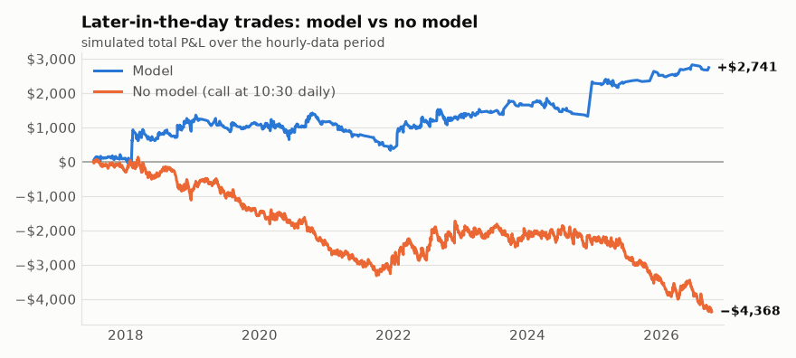
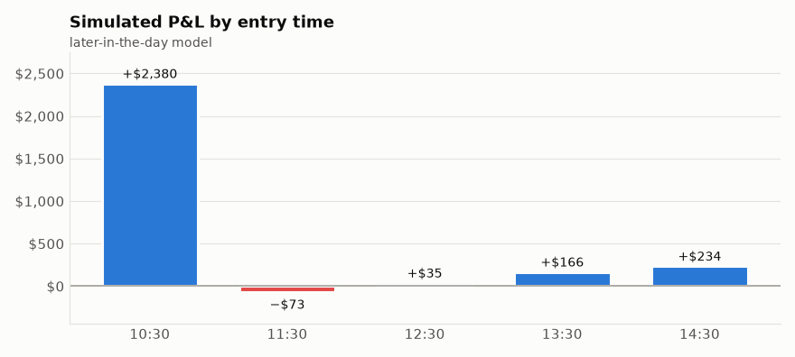
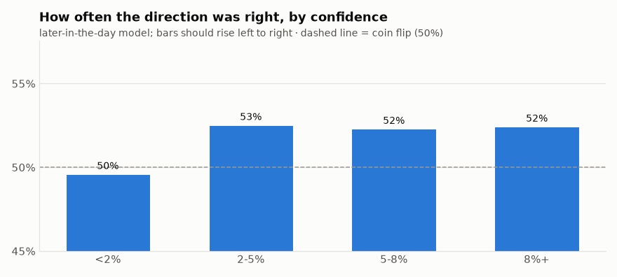
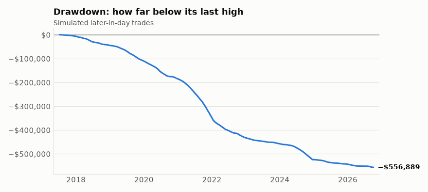

# SPY model backtest - 2026-10-03

Tested 2021-10-20 to 2026-10-01 (1242 days), model = logistic, prediction = SPY closes above the open by today's close, edge threshold = 0.08.

## Does the model predict direction?
- AUC: **0.482** (0.50 = coin flip; below ~0.53 is not a usable edge)
- SPY closed above the open by today's close 53% of the time overall.
- When the model said UP (93 days): rose 55% of the time.
- When the model said DOWN (48 days): fell 52% of the time.

## Simulated single options ($90-$140 premium, $40 stop, trailing ladder, ~7 DTE, same-day trades)

### Morning model signals (analysis: the bot doesn't buy at the open unless trade.morning_entries is true)
- Trades: 141  |  Win rate: 21%
- Avg win: $151.72  |  Avg loss: $-38.15
- Total P&L: $127.34  |  Per trade: $0.90
- Worst drawdown: $-1830.15  |  Longest losing streak: 23
- Exits: {'stop': 104, 'close': 32, 'trail stop': 5}

### Baseline: buy a call whenever flat (no model)
- Trades: 1242  |  Win rate: 25%
- Avg win: $60.04  |  Avg loss: $-36.63
- Total P&L: $-15626.56  |  Per trade: $-12.58
- Worst drawdown: $-15734.96  |  Longest losing streak: 25
- Exits: {'stop': 808, 'close': 400, 'trail stop': 34}

## How to read this
- The model is only worth using if it clearly beats the baseline AND the AUC is meaningfully above 0.50. If not, it has no edge.
- Option prices are estimated with Black-Scholes using VIX as volatility. Real fills, skew and spreads differ, so treat dollar figures as rough.
- Same-day trades: the stop and ladder are checked against each day's high and low, assuming the worst order (low first for calls). Real results with a live stop order can differ either way.
- If you decide to trust it, set "approved": true in config.json. Until then the alert only reports the signal.

## Model trades on event days vs normal days

| Day type | Trades | Win rate | P&L | Avg per trade |
|---|---|---|---|---|
| cpi | 4 | 50% | $108.75 | $27.19 |
| fomc | 34 | 32% | $1795.85 | $52.82 |
| fomc, cpi | 1 | 0% | $-40.10 | $-40.10 |
| jobs | 33 | 21% | $-472.62 | $-14.32 |
| normal day | 69 | 13% | $-1264.54 | $-18.33 |

_If one event type loses money consistently, add it to `trade.skip_events` in config.json (e.g. ["fomc"]) and rerun the backtest._

## Model P&L by year

| Year | Trades | P&L |
|---|---|---|
| 2021 | 9 | $-333.28 |
| 2022 | 66 | $-1342.43 |
| 2023 | 15 | $-67.38 |
| 2024 | 22 | $1326.14 |
| 2025 | 22 | $-368.74 |
| 2026 | 7 | $913.03 |

## Does confidence matter? (morning model)

| How far from normal | Predictions | Direction right | Trades | Trade P&L | Avg per trade |
|---|---|---|---|---|---|
| under 2% | 669 | 49% | 0 | $0.00 | - |
| 2-5% | 326 | 45% | 0 | $0.00 | - |
| 5-8% | 106 | 48% | 0 | $0.00 | - |
| 8% or more | 141 | 54% | 141 | $127.34 | $0.90 |

_If "direction right" doesn't rise as the model gets more confident, the model isn't finding anything real, whatever the totals say._

## Look-ahead self-test

**PASSED.** Every model input was rebuilt with the future cut off or scrambled, and nothing changed: no input peeks ahead.

## Option pricing check (estimated vs real quotes)

No real quotes recorded yet. The watcher records them every few minutes; the check starts once there are 500+ quotes from 5+ days.

## Later-in-the-day entries (hourly data, 2017-07-10 to 2026-10-02)

At each check from ~10:30 AM to 14:30, a second model predicts whether SPY closes today above its price at that moment. It also sees the first-hour range, yesterday's high/low, VWAP and volume. Trained on hourly data only (~2 years), so less certain than the morning model. Includes time decay.

- AUC: **0.522** over 11565 checkpoints on 2313 days

### Model trades (first signal of each day)
- Trades: 923  |  Win rate: 39%
- Avg win: $52.37  |  Avg loss: $-28.61
- Total P&L: $2741.28  |  Per trade: $2.97
- Worst drawdown: $-1090.24  |  Longest losing streak: 9
- Exits: {'close': 557, 'stop': 317, 'trail stop': 49}

### Baseline: buy a call at 10:30 every day (no model)
- Trades: 2312  |  Win rate: 38%
- Avg win: $44.51  |  Avg loss: $-30.82
- Total P&L: $-4368.29  |  Per trade: $-1.89
- Worst drawdown: $-4516.97  |  Longest losing streak: 15
- Exits: {'close': 1281, 'stop': 948, 'trail stop': 83}

_The model only deserves credit for what it makes ABOVE this baseline._

### Strongest signals only (what would trigger a real alert)

Real alerts need confidence ≥ 12%; paper trades need ≥ 8%. Strong signals came about 0.9 times per week.

| Group | Trades | Win rate | P&L | Avg per trade |
|---|---|---|---|---|
| strong (≥ 12%): real-alert trades | 315 | 38% | $1277.24 | $4.05 |
| normal (8%–12%): paper only | 608 | 40% | $1464.04 | $2.41 |

_If the strong group isn't clearly better per trade, the real-alert bar isn't picking better trades and should be revisited._

### By entry time

| Entry time | Trades | Win rate | P&L | Avg |
|---|---|---|---|---|
| 10:30 | 624 | 39% | $2379.70 | $3.81 |
| 11:30 | 108 | 28% | $-72.81 | $-0.67 |
| 12:30 | 69 | 36% | $35.26 | $0.51 |
| 13:30 | 63 | 52% | $165.51 | $2.63 |
| 14:30 | 59 | 44% | $233.62 | $3.96 |

### Does confidence matter? (later-in-the-day model)

| How far from normal | Predictions | Direction right | Trades | Trade P&L | Avg per trade |
|---|---|---|---|---|---|
| under 2% | 2486 | 50% | 0 | $0.00 | - |
| 2-5% | 3411 | 53% | 0 | $0.00 | - |
| 5-8% | 2392 | 52% | 0 | $0.00 | - |
| 8% or more | 3276 | 52% | 923 | $2741.28 | $2.97 |

_If "direction right" doesn't rise as the model gets more confident, the model isn't finding anything real, whatever the totals say._

## The committee: each model alone vs voting together

Current setting: `intraday_model = committee`, members = simple, levels, flexible, `require_agreement = False`

| Model | AUC | Trades | Win rate | P&L | Avg per trade |
|---|---|---|---|---|---|
| simple (logistic) | 0.521 | 842 | 39% | $2791.82 | $3.32 |
| levels (logistic) | 0.522 | 1019 | 39% | $1949.92 | $1.91 |
| flexible (gbm) | 0.512 | 1514 | 38% | $539.91 | $0.36 |
| structure (logistic) | 0.514 | 1270 | 37% | $1068.07 | $0.84 |
| trend (logistic) | 0.525 | 1272 | 39% | $1723.83 | $1.36 |
| smc (logistic) | 0.517 | 1242 | 38% | $641.09 | $0.52 |
| momentum (logistic) | 0.528 | 1031 | 40% | $4274.57 | $4.15 |
| ict (logistic) | 0.518 | 1185 | 38% | $1129.98 | $0.95 |
| **judge** (decides from all models + structure) | 0.509 | 1275 | 37% | $-2115.94 | $-1.66 |
| all 3 averaged | 0.522 | 923 | 39% | $2741.28 | $2.97 |
| **committee in use (simple + levels + flexible)** | 0.522 | 923 | 39% | $2741.28 | $2.97 |
| committee in use, only when members agree | - | 838 | 40% | $2841.70 | $3.39 |

_A committee usually makes fewer wild calls than any single member. Prefer it unless one member is clearly and consistently better._

## Skill or luck? (quant checks)

| Measure | Value | What it means |
|---|---|---|
| Sharpe ratio | 0.47 | return per unit of day-to-day swings, yearly. Above 1 is good, above 2 is rare |
| Sortino ratio | 1.18 | like Sharpe, but only counts the down days as risk |
| Worst drawdown | $-1090 | biggest drop from a high point (1 contract at a time) |
| Longest drawdown | 466 trading days | longest stretch below a previous high |
| Profit factor | 1.17 | dollars won per dollar lost. Above 1.3 is solid |
| Average win / loss | $52 / $-29 | |

**If you act an hour late** (signal at one check, buy at the next): 864 trades, $-69 (vs $2741 on time). The edge does NOT survive a delay: act fast or not at all.

**Monte Carlo permutation test** (2,000 random runs). The model made **$2741**.
- Random trades on the same days (random time, random call/put): typical $-329, top 5% $2196. Chance random does as well: **2.1%**.
- Same entry times, random call/put: typical $-230. Chance random direction does as well: **2.3%**.
- Verdict: **looks like skill** (both chances under 5% = skill).

**Which information helps?** One model with every input, trained before 2023-12-14, scored after (accuracy AUC 0.525). Each group is scrambled to see how much accuracy it was carrying:

| Information | Accuracy lost when scrambled | Helps? |
|---|---|---|
| ICT (overnight sweeps, SMT divergence, killzones, weekly premium/discount) | +0.0158 (±0.0049) | yes |
| months-long trend + elections | +0.0139 (±0.0054) | yes |
| intraday momentum + volatility regime | +0.0129 (±0.0016) | yes |
| smart money (structure, order blocks, sweeps) | +0.0071 (±0.0043) | maybe |
| day-trader levels | -0.0000 (±0.0019) | no |
| support/resistance + FVG | -0.0006 (±0.0071) | no |
| today's move (simple) | -0.0022 (±0.0027) | no |

_Groups that don't help are candidates to drop; the self-tuner tests that with real P&L._

## From prediction to P&L

| Signal strength | Trades | SPY moved our way by the close | Avg SPY move our way | Avg option return | Avg P&L | Total P&L |
|---|---|---|---|---|---|---|
| under 10% | 427 | 51% | +0.01% | +1.8% | $+2.03 | $+865.82 |
| 10-15% | 333 | 53% | +0.04% | +2.7% | $+3.61 | $+1202.86 |
| 15% or more | 163 | 51% | +0.06% | +3.4% | $+4.13 | $+672.60 |

_Stronger signals should show a bigger SPY move our way, then a bigger option return. If the SPY move is right but the option return isn't, the edge is lost in time decay, the stop or costs._

## Execution stress (worse fills)

Base case: buy $0.02/share above the middle price and sell $0.02 below it (about the ask and the bid), plus $0.10 fees per round trip.

| Fill vs middle price, each side | Trades | Total P&L |
|---|---|---|
| $0.02/share ($2 per contract) ← assumed | 923 | $+2741.28 |
| $0.04/share ($4 per contract) | 923 | $-1573.14 |
| $0.06/share ($6 per contract) | 922 | $-6144.68 |

**Break-even:** the edge disappears at about **$0.03/share** each side ($3 per contract). Real SPY weekly option spreads near the money are usually a few cents wide, so fills worse than that would erase the profit.

## What if the option price range were different? (report only)

Same signals, same $40 stop, sized for the current account (the bot never uses more than 80% of it or dips below the $30 cash buffer).

| Option price range | Trades | Win rate | Total P&L | Avg per trade | Worst drawdown | Longest losing streak |
|---|---|---|---|---|---|---|
| $90-$140 ← current | 923 | 39% | $2741.28 | $2.97 | $-1090 | 9 |
| $90-$110 | 797 | 39% | $1390.95 | $1.75 | $-969 | 11 |

_Pricier options sit closer to the money: they move more per $1 of SPY, but the same $ stop is a smaller share of their price, so normal wiggles stop them out more often._

## Self-improvement check (one change at a time vs the current setup)

Current setup: committee simple + levels + flexible, exit runner, confidence bar 8%, bots on: none.

**Rules.** Only the 6 pre-registered changes can be adopted; the other 39 are exploratory and only reported. Selection uses the days before 2026-04-06; the last 126 trading days from 2026-04-06 are a final exam it never selects on. A change must add at least $384, win in both halves (before and after 2021-11-09), have a steady daily edge (Newey-West t ≥ 3.0), not be less robust (Sharpe not lower, worst drawdown not >10% deeper), do at least as well in the final exam, and the pre-registered set must not look overfit (PBO below 50%).

**Overfitting checks:** probability of backtest overfitting (PBO) **57%** across 7 pre-registered setups (near 0% = picking the best works; 50%+ = it's luck). Deflated Sharpe of the best change (confidence bar → 10%): **79%** after 202 setups tried in total (above 95% = its Sharpe beats what luck alone would produce).

| Change | Kind | Trades | Selection P&L | Older half | Newer half | Final exam | Sharpe | Worst drawdown | Steadiness | Verdict |
|---|---|---|---|---|---|---|---|---|---|---|
| **current setup** | - | 909 | $2560.92 | $462.91 | $2098.01 | $180.36 | 0.46 | $-1090 | - | - |
| committee → all specialists, equal weight | registered | 941 | $2144.50 | $653.57 | $1490.93 | $273.86 | 0.38 | $-1308 | -0.4 | no |
| confidence bar → 10% | registered | 639 | $2821.36 | $468.15 | $2353.21 | $211.03 | 0.55 | $-1082 | +0.4 | no |
| confidence bar → 6% | registered | 1250 | $1987.56 | $581.27 | $1406.29 | $465.22 | 0.32 | $-1552 | -0.6 | no |
| exit style → runner_loose | registered | 909 | $2478.21 | $303.52 | $2174.69 | $355.96 | 0.44 | $-1090 | -0.3 | no |
| exit style → runner_tight | registered | 909 | $2217.32 | $188.23 | $2029.09 | $250.86 | 0.42 | $-1043 | -0.6 | no |
| turn ON the EV filter (trade only when expected value > 0) (from 2017-09-07, when the EV filter had learned enough; current setup $2444.22 on the same days) | registered | 1223 | $920.13 | $-874.47 | $1794.60 | $112.33 | 0.18 | $-2151 | -1.0 | no |
| bots together: mood + exit | exploratory | 679 | $2885.39 | $911.62 | $1973.77 | $110.80 | 0.58 | $-776 | +0.4 | no |
| bots together: risk + exit | exploratory | 758 | $1739.14 | $-173.53 | $1912.67 | $220.46 | 0.35 | $-1006 | -1.0 | no |
| bots together: risk + mood | exploratory | 545 | $2205.66 | $769.20 | $1436.46 | $150.90 | 0.47 | $-875 | -0.4 | no |
| bots together: risk + mood + exit | exploratory | 545 | $2252.05 | $653.13 | $1598.92 | $150.90 | 0.49 | $-723 | -0.3 | no |
| committee → ict | exploratory | 1162 | $1000.34 | $134.63 | $865.71 | $129.64 | 0.19 | $-1505 | -1.2 | no |
| committee → judge | exploratory | 1229 | $-2294.30 | $-1105.80 | $-1188.50 | $178.36 | -0.47 | $-2594 | -2.3 | no |
| committee → judge + simple | exploratory | 894 | $153.65 | $111.81 | $41.84 | $65.87 | 0.03 | $-1486 | -1.5 | no |
| committee → judge + simple + levels | exploratory | 873 | $1984.95 | $1254.46 | $730.49 | $183.28 | 0.42 | $-848 | -0.4 | no |
| committee → levels + trend | exploratory | 1066 | $1934.86 | $295.09 | $1639.77 | $253.70 | 0.34 | $-1749 | -0.5 | no |
| committee → momentum | exploratory | 1010 | $3990.48 | $944.73 | $3045.75 | $284.09 | 0.68 | $-1346 | +1.0 | no |
| committee → momentum + smc | exploratory | 1045 | $1366.16 | $370.16 | $996.00 | $-71.45 | 0.24 | $-1766 | -1.0 | no |
| committee → simple | exploratory | 826 | $2396.13 | $-49.85 | $2445.98 | $395.69 | 0.44 | $-1343 | -0.1 | no |
| committee → simple + ict | exploratory | 978 | $2228.97 | $124.92 | $2104.05 | $317.91 | 0.39 | $-1264 | -0.3 | no |
| committee → simple + levels | exploratory | 895 | $2569.04 | $244.89 | $2324.15 | $340.77 | 0.47 | $-1388 | +0.0 | no |
| committee → simple + levels + flexible + ict | exploratory | 911 | $2552.85 | $410.31 | $2142.54 | $142.96 | 0.44 | $-1359 | -0.0 | no |
| committee → simple + levels + flexible + momentum | exploratory | 856 | $3584.57 | $576.66 | $3007.91 | $220.36 | 0.64 | $-1182 | +1.6 | no |
| committee → simple + levels + flexible + smc | exploratory | 932 | $2692.45 | $626.74 | $2065.71 | $168.18 | 0.48 | $-1146 | +0.2 | no |
| committee → simple + levels + flexible + trend | exploratory | 926 | $2413.68 | $-302.21 | $2715.89 | $335.07 | 0.44 | $-1787 | -0.2 | no |
| committee → simple + levels + smc | exploratory | 960 | $1554.88 | $251.45 | $1303.43 | $60.27 | 0.28 | $-1420 | -0.9 | no |
| committee → simple + levels + structure | exploratory | 969 | $2420.77 | $802.90 | $1617.87 | $216.34 | 0.44 | $-956 | -0.1 | no |
| committee → simple + levels + structure + trend | exploratory | 966 | $2412.27 | $1095.23 | $1317.04 | $363.34 | 0.43 | $-955 | -0.1 | no |
| committee → simple + levels + trend | exploratory | 963 | $2195.31 | $584.09 | $1611.22 | $145.34 | 0.40 | $-1300 | -0.3 | no |
| committee → simple + momentum | exploratory | 878 | $3118.56 | $666.91 | $2451.65 | $292.34 | 0.57 | $-1299 | +0.4 | no |
| committee → simple + momentum + ict | exploratory | 933 | $2329.64 | $728.64 | $1601.00 | $258.17 | 0.42 | $-1121 | -0.2 | no |
| committee → simple + momentum + smc | exploratory | 942 | $2967.64 | $967.62 | $2000.02 | $31.77 | 0.53 | $-966 | +0.3 | no |
| committee → simple + smc | exploratory | 979 | $1108.01 | $-30.99 | $1139.00 | $-15.33 | 0.20 | $-1946 | -1.2 | no |
| committee → simple + smc + ict | exploratory | 996 | $2053.32 | $468.88 | $1584.44 | $95.98 | 0.36 | $-1511 | -0.5 | no |
| committee → simple + smc + momentum | exploratory | 942 | $2967.64 | $967.62 | $2000.02 | $31.77 | 0.53 | $-966 | +0.3 | no |
| committee → simple + smc + momentum + ict | exploratory | 950 | $2059.25 | $346.27 | $1712.98 | $53.61 | 0.37 | $-1374 | -0.5 | no |
| committee → simple + structure | exploratory | 957 | $1784.78 | $589.85 | $1194.93 | $162.38 | 0.33 | $-765 | -0.7 | no |
| committee → simple + trend | exploratory | 987 | $2255.82 | $-58.02 | $2313.84 | $480.51 | 0.41 | $-1617 | -0.2 | no |
| committee → simple + trend + smc | exploratory | 1008 | $1495.23 | $401.27 | $1093.96 | $247.41 | 0.27 | $-1525 | -0.9 | no |
| committee → smc | exploratory | 1216 | $679.53 | $299.62 | $379.91 | $-38.44 | 0.12 | $-1905 | -1.3 | no |
| committee → smc + ict | exploratory | 1124 | $1703.92 | $489.60 | $1214.32 | $-27.71 | 0.29 | $-1851 | -0.7 | no |
| committee → structure | exploratory | 1230 | $832.12 | $698.63 | $133.49 | $235.95 | 0.14 | $-1489 | -1.3 | no |
| committee → trend | exploratory | 1239 | $1220.30 | $-939.72 | $2160.02 | $503.53 | 0.20 | $-2329 | -0.8 | no |
| turn ON the exit bot | exploratory | 909 | $2407.20 | $185.56 | $2221.64 | $180.36 | 0.45 | $-1083 | -0.3 | no |
| turn ON the mood bot | exploratory | 679 | $3184.20 | $1194.02 | $1990.18 | $110.80 | 0.62 | $-777 | +0.9 | no |
| turn ON the risk bot | exploratory | 758 | $1541.82 | $-18.45 | $1560.27 | $220.46 | 0.30 | $-1218 | -1.4 | no |

No change cleared the bar. The current setup stays.

## Exit styles compared (same signals, different exits)

| Exit style | Morning trades P&L | Morning win rate | Later-in-day P&L | Later-in-day win rate |
|---|---|---|---|---|
| runner_tight | $246.76 | 22% | $2468.18 | 37% |
| runner ← current | $127.34 | 21% | $2741.28 | 39% |
| runner_loose | $11.13 | 21% | $2834.17 | 40% |

All three: $40 stop, no profit target, the stop only moves up.
- **runner_tight**: breakeven at +30%, lock +25% at +60%, +60% at +100%, +120% at +200%
- **runner**: breakeven at +50%, lock +50% at +100%, +100% at +200%
- **runner_loose**: breakeven at +75%, lock +60% at +150%, +150% at +300%

_Pick with care: choosing the best of three is a small form of fitting the past. Prefer a style that does well in BOTH columns._

## Simple vs flexible model (AUC, higher is better, 0.50 = coin flip)

| Model | Morning | Later-in-day |
|---|---|---|
| logistic ← current | 0.482 | 0.522 |
| gbm | 0.477 | 0.512 |

_Switch `model.model_type` only if the other one is clearly better in both columns._

## Morning trades: bought at the open vs about an hour later

Same 140 morning-signal days in the hourly-data period:

| Entry | Total P&L | Avg per trade | Win rate |
|---|---|---|---|
| At the 9:30 open (what the main backtest assumes) | $73.02 | $0.52 | 20% |
| ~10:30 AM (closer to when you'd really buy) | $246.00 | $1.76 | 31% |

_If the later entry is much worse, the morning edge disappears by the time you can act on it._
