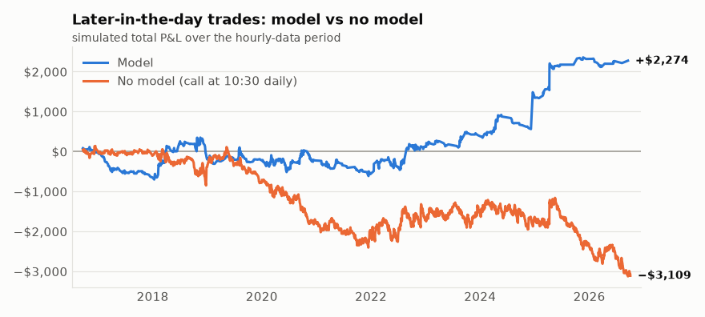
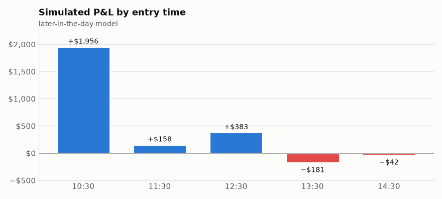
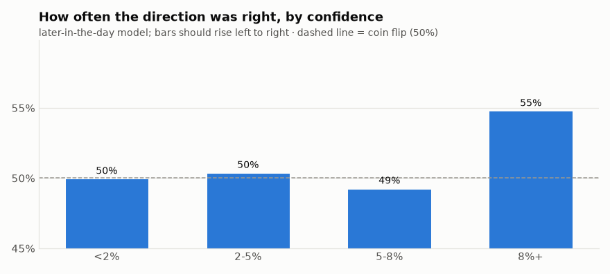
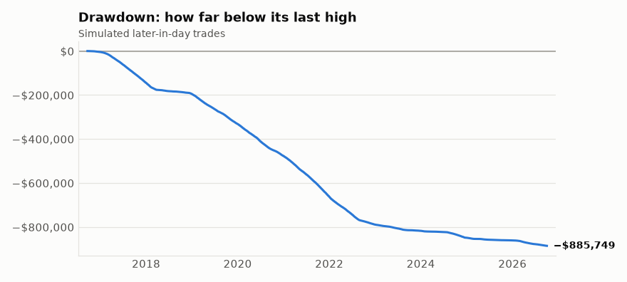

# SPY model backtest - 2026-10-04

Tested 2011-10-20 to 2026-10-01 (3758 days), model = logistic, prediction = SPY closes above the open by today's close, edge threshold = 0.08.

## Does the model predict direction?
- AUC: **0.498** (0.50 = coin flip; below ~0.53 is not a usable edge)
- SPY closed above the open by today's close 54% of the time overall.
- When the model said UP (58 days): rose 48% of the time.
- When the model said DOWN (114 days): fell 51% of the time.

## Simulated single options ($90-$110 premium, $40 stop, trailing ladder, ~7 DTE, same-day trades)

### Morning model signals (analysis: the bot doesn't buy at the open unless trade.morning_entries is true)
- Trades: 130  |  Win rate: 32%
- Avg win: $65.17  |  Avg loss: $-34.57
- Total P&L: $-304.73  |  Per trade: $-2.34
- Worst drawdown: $-1081.55  |  Longest losing streak: 9
- Exits: {'stop': 67, 'close': 59, 'trail stop': 4}

### Baseline: buy a call whenever flat (no model)
- Trades: 2898  |  Win rate: 31%
- Avg win: $37.92  |  Avg loss: $-30.63
- Total P&L: $-26315.56  |  Per trade: $-9.08
- Worst drawdown: $-26283.58  |  Longest losing streak: 24
- Exits: {'close': 1532, 'stop': 1252, 'trail stop': 114}

## How to read this
- The model is only worth using if it clearly beats the baseline AND the AUC is meaningfully above 0.50. If not, it has no edge.
- Option prices are estimated with Black-Scholes using VIX as volatility. Real fills, skew and spreads differ, so treat dollar figures as rough.
- Same-day trades: the stop and ladder are checked against each day's high and low, assuming the worst order (low first for calls). Real results with a live stop order can differ either way.
- If you decide to trust it, set "approved": true in config.json. Until then the alert only reports the signal.

## Model trades on event days vs normal days

| Day type | Trades | Win rate | P&L | Avg per trade |
|---|---|---|---|---|
| cpi | 41 | 54% | $743.57 | $18.14 |
| fomc | 6 | 33% | $47.49 | $7.91 |
| fomc, cpi | 3 | 33% | $-16.19 | $-5.40 |
| jobs | 9 | 22% | $-212.57 | $-23.62 |
| normal day | 71 | 21% | $-867.03 | $-12.21 |

_If one event type loses money consistently, add it to `trade.skip_events` in config.json (e.g. ["fomc"]) and rerun the backtest._

## Model P&L by year

| Year | Trades | P&L |
|---|---|---|
| 2011 | 5 | $66.73 |
| 2012 | 10 | $133.18 |
| 2013 | 10 | $81.31 |
| 2014 | 7 | $61.03 |
| 2015 | 18 | $-301.67 |
| 2016 | 9 | $-84.45 |
| 2017 | 2 | $-36.18 |
| 2018 | 9 | $-72.10 |
| 2019 | 4 | $-143.86 |
| 2020 | 21 | $-140.08 |
| 2021 | 7 | $-151.76 |
| 2022 | 12 | $343.32 |
| 2024 | 7 | $-124.97 |
| 2025 | 8 | $104.87 |
| 2026 | 1 | $-40.10 |

## Does confidence matter? (morning model)

| How far from normal | Predictions | Direction right | Trades | Trade P&L | Avg per trade |
|---|---|---|---|---|---|
| under 2% | 2005 | 51% | 0 | $0.00 | - |
| 2-5% | 1271 | 51% | 0 | $0.00 | - |
| 5-8% | 310 | 50% | 0 | $0.00 | - |
| 8% or more | 172 | 50% | 130 | $-304.73 | $-2.34 |

_If "direction right" doesn't rise as the model gets more confident, the model isn't finding anything real, whatever the totals say._

## Look-ahead self-test

**PASSED.** Every model input was rebuilt with the future cut off or scrambled, and nothing changed: no input peeks ahead.

## Option pricing check (estimated vs real quotes)

No real quotes recorded yet. The watcher records them every few minutes; the check starts once there are 500+ quotes from 5+ days.

**Data check:** each day's last hourly close vs the daily close on 2703 days: median gap 0.009%, worst 1.05%. ✅ same price basis.

## Later-in-the-day entries (hourly data, 2016-09-20 to 2026-10-02)

At each check from ~10:30 AM to 14:30, a second model predicts whether SPY closes today above its price at that moment. It also sees the first-hour range, yesterday's high/low, VWAP and volume. Trained on hourly data only (~2 years), so less certain than the morning model. Includes time decay.

- AUC: **0.523** over 12570 checkpoints on 2514 days

### Model trades (first signal of each day)
- Trades: 756  |  Win rate: 39%
- Avg win: $47.45  |  Avg loss: $-25.43
- Total P&L: $2274.25  |  Per trade: $3.01
- Worst drawdown: $-962.59  |  Longest losing streak: 13
- Exits: {'close': 498, 'stop': 205, 'trail stop': 53}

### Baseline: buy a call at 10:30 every day (no model)
- Trades: 2200  |  Win rate: 40%
- Avg win: $38.14  |  Avg loss: $-28.18
- Total P&L: $-3108.51  |  Per trade: $-1.41
- Worst drawdown: $-3264.99  |  Longest losing streak: 14
- Exits: {'close': 1358, 'stop': 739, 'trail stop': 103}

_The model only deserves credit for what it makes ABOVE this baseline._

### Strongest signals only (what would trigger a real alert)

Real alerts need confidence ≥ 12%; paper trades need ≥ 8%. Strong signals came about 0.6 times per week.

| Group | Trades | Win rate | P&L | Avg per trade |
|---|---|---|---|---|
| strong (≥ 12%): real-alert trades | 224 | 42% | $617.23 | $2.76 |
| normal (8%–12%): paper only | 532 | 38% | $1657.02 | $3.11 |

_If the strong group isn't clearly better per trade, the real-alert bar isn't picking better trades and should be revisited._

### By entry time

| Entry time | Trades | Win rate | P&L | Avg |
|---|---|---|---|---|
| 10:30 | 468 | 39% | $1956.49 | $4.18 |
| 11:30 | 92 | 41% | $157.56 | $1.71 |
| 12:30 | 67 | 42% | $382.81 | $5.71 |
| 13:30 | 65 | 38% | $-180.84 | $-2.78 |
| 14:30 | 64 | 33% | $-41.77 | $-0.65 |

### Does confidence matter? (later-in-the-day model)

| How far from normal | Predictions | Direction right | Trades | Trade P&L | Avg per trade |
|---|---|---|---|---|---|
| under 2% | 3242 | 50% | 0 | $0.00 | - |
| 2-5% | 3669 | 50% | 0 | $0.00 | - |
| 5-8% | 2586 | 49% | 0 | $0.00 | - |
| 8% or more | 3073 | 55% | 756 | $2274.25 | $3.01 |

_If "direction right" doesn't rise as the model gets more confident, the model isn't finding anything real, whatever the totals say._

## The committee: each model alone vs voting together

Current setting: `intraday_model = committee`, members = simple, levels, flexible, `require_agreement = False`

| Model | AUC | Trades | Win rate | P&L | Avg per trade |
|---|---|---|---|---|---|
| simple (logistic) | 0.520 | 709 | 40% | $1251.91 | $1.77 |
| levels (logistic) | 0.517 | 809 | 39% | $834.96 | $1.03 |
| flexible (gbm) | 0.522 | 1312 | 41% | $2519.24 | $1.92 |
| structure (logistic) | 0.517 | 932 | 39% | $2185.01 | $2.34 |
| trend (logistic) | 0.510 | 1016 | 40% | $2706.31 | $2.66 |
| smc (logistic) | 0.512 | 881 | 39% | $985.33 | $1.12 |
| momentum (logistic) | 0.529 | 904 | 42% | $1780.96 | $1.97 |
| ict (logistic) | 0.508 | 899 | 38% | $285.89 | $0.32 |
| five (logistic) | 0.522 | 1142 | 39% | $428.70 | $0.38 |
| forest (forest) | 0.533 | 493 | 41% | $-475.91 | $-0.97 |
| deep (mlp) | 0.510 | 2177 | 38% | $-2869.52 | $-1.32 |
| **judge** (decides from all models + structure) | 0.518 | 1057 | 36% | $-2242.94 | $-2.12 |
| hedge (learns each model's weight from its recent accuracy) | 0.515 | 610 | 41% | $445.57 | $0.73 |
| all 3 averaged | 0.523 | 756 | 39% | $2274.25 | $3.01 |
| **committee in use (simple + levels + flexible)** | 0.523 | 756 | 39% | $2274.25 | $3.01 |
| committee in use, only when members agree | - | 702 | 39% | $1705.85 | $2.43 |

_A committee usually makes fewer wild calls than any single member. Prefer it unless one member is clearly and consistently better._

## Train-then-test: chosen on the years before 2024-01-01, tested on 2024-01-01 to now

Every model's predictions are already out-of-sample (each is retrained only on earlier days). On top of that, the self-tuner and any choice between models may only look at the years before 2024-01-01; the later years are the test it never sees when choosing. A model that only shines before the split was probably lucky.

| Model | Trades before | Avg before | Trades 2024+ | Avg 2024+ | Total 2024+ |
|---|---|---|---|---|---|
| simple (logistic) | 588 | $+0.29 | 121 | $+8.96 | $+1083.67 |
| levels (logistic) | 695 | $-0.32 | 114 | $+9.25 | $+1054.16 |
| flexible (gbm) | 1007 | $+0.71 | 305 | $+5.92 | $+1805.98 |
| structure (logistic) | 772 | $+1.00 | 160 | $+8.84 | $+1413.65 |
| trend (logistic) | 827 | $+1.01 | 189 | $+9.91 | $+1872.17 |
| smc (logistic) | 745 | $-0.24 | 136 | $+8.57 | $+1165.92 |
| momentum (logistic) | 742 | $+1.59 | 162 | $+3.72 | $+602.67 |
| ict (logistic) | 747 | $+0.03 | 152 | $+1.72 | $+260.71 |
| five (logistic) | 946 | $-0.09 | 196 | $+2.63 | $+515.59 |
| forest (forest) | 379 | $+0.75 | 114 | $-6.67 | $-760.81 |
| deep (mlp) | 1497 | $-1.41 | 680 | $-1.11 | $-755.52 |
| **judge** (decides from all models + structure) | 858 | $-2.18 | 199 | $-1.88 | $-374.56 |
| hedge (learns each model's weight from its recent accuracy) | 498 | $+0.05 | 112 | $+3.77 | $+422.50 |
| all 3 averaged | 640 | $+0.65 | 116 | $+16.02 | $+1858.24 |
| **committee in use (simple + levels + flexible)** | 640 | $+0.65 | 116 | $+16.02 | $+1858.24 |
| committee in use, only when members agree | 596 | $+0.88 | 106 | $+11.13 | $+1179.59 |

## Combination search: 220 mixes of 2-3 specialists

Ranked only on the years before 2024-01-01 (Sharpe of daily P&L); the 2024+ columns are the test the ranking never saw. Overfitting check across all mixes (PBO): **37%** (below 50% = picking the best mix on the early years tends to hold up later). The top 3 join the league as forward paper-trading contenders; none is switched on from this table.

| Mix | Trades before | Avg before | Sharpe before | Trades 2024+ | Avg 2024+ | Total 2024+ |
|---|---|---|---|---|---|---|
| structure+forest | 487 | $+3.57 | 0.69 | 89 | $+9.93 | $+883.50 |
| simple+structure+forest | 479 | $+3.23 | 0.61 | 87 | $+6.88 | $+598.77 |
| simple+forest | 356 | $+2.90 | 0.47 | 64 | $+8.68 | $+555.80 |
| flexible+smc | 757 | $+2.08 | 0.47 | 169 | $+7.18 | $+1212.72 |
| simple+levels+forest | 458 | $+2.44 | 0.44 | 77 | $+13.85 | $+1066.75 |
| flexible+trend+momentum | 681 | $+2.09 | 0.43 | 132 | $+12.49 | $+1648.91 |
| flexible+structure+five | 718 | $+1.92 | 0.43 | 139 | $+8.80 | $+1223.33 |
| flexible+momentum+ict | 678 | $+1.99 | 0.42 | 134 | $+13.30 | $+1782.38 |
| levels+structure+forest | 541 | $+2.01 | 0.42 | 93 | $+11.85 | $+1101.77 |
| levels+forest | 433 | $+2.24 | 0.40 | 69 | $+7.66 | $+528.52 |

## Skill or luck? (quant checks)

| Measure | Value | What it means |
|---|---|---|
| Sharpe ratio | 0.43 | return per unit of day-to-day swings, yearly. Above 1 is good, above 2 is rare |
| Sortino ratio | 1.13 | like Sharpe, but only counts the down days as risk |
| Worst drawdown | $-963 | biggest drop from a high point (1 contract at a time) |
| Longest drawdown | 1197 trading days | longest stretch below a previous high |
| Profit factor | 1.19 | dollars won per dollar lost. Above 1.3 is solid |
| Average win / loss | $47 / $-25 | |

**If you act an hour late** (signal at one check, buy at the next): 697 trades, $491 (vs $2274 on time). The edge survives delays.

**Monte Carlo permutation test** (2,000 random runs). The model made **$2274**.
- Random trades on the same days (random time, random call/put): typical $106, top 5% $2221. Chance random does as well: **4.5%**.
- Same entry times, random call/put: typical $517. Chance random direction does as well: **7.2%**.
- Verdict: **not clearly better than luck yet** (both chances under 5% = skill).

**Which information helps?** One model with every input, trained before 2023-09-18, scored after (accuracy AUC 0.549). Each group is scrambled to see how much accuracy it was carrying:

| Information | Accuracy lost when scrambled | Helps? |
|---|---|---|
| support/resistance + FVG | +0.0296 (±0.0084) | yes |
| today's move (simple) | +0.0181 (±0.0027) | yes |
| months-long trend + elections | +0.0174 (±0.0041) | yes |
| intraday momentum + volatility regime | +0.0144 (±0.0035) | yes |
| smart money (structure, order blocks, sweeps) | +0.0113 (±0.0042) | yes |
| 5- and 15-minute charts (AMD sweep, IFVG, 50% of range, retests, buy/sell pressure) | +0.0093 (±0.0035) | yes |
| day-trader levels | +0.0081 (±0.0036) | yes |
| ICT (overnight sweeps, SMT divergence, killzones, weekly premium/discount) | -0.0032 (±0.0003) | no |

_Groups that don't help are candidates to drop; the self-tuner tests that with real P&L._

## From prediction to P&L

| Signal strength | Trades | SPY moved our way by the close | Avg SPY move our way | Avg option return | Avg P&L | Total P&L |
|---|---|---|---|---|---|---|
| under 10% | 387 | 49% | +0.04% | +0.7% | $+0.86 | $+334.22 |
| 10-15% | 265 | 55% | +0.02% | +8.2% | $+8.30 | $+2200.24 |
| 15% or more | 104 | 54% | +0.04% | -2.2% | $-2.50 | $-260.21 |

_Stronger signals should show a bigger SPY move our way, then a bigger option return. If the SPY move is right but the option return isn't, the edge is lost in time decay, the stop or costs._

## Execution stress (worse fills)

Base case: buy $0.02/share above the middle price and sell $0.02 below it (about the ask and the bid), plus $0.10 fees per round trip.

| Fill vs middle price, each side | Trades | Total P&L |
|---|---|---|
| $0.02/share ($2 per contract) ← assumed | 756 | $+2274.25 |
| $0.04/share ($4 per contract) | 760 | $-1038.41 |
| $0.06/share ($6 per contract) | 765 | $-4219.12 |

**Break-even:** the edge disappears at about **$0.03/share** each side ($3 per contract). Real SPY weekly option spreads near the money are usually a few cents wide, so fills worse than that would erase the profit.

## What if the option price range were different? (report only)

Same signals, same $40 stop, sized for the current account (the bot never uses more than 80% of it or dips below the $30 cash buffer).

| Option price range | Trades | Win rate | Total P&L | Avg per trade | Worst drawdown | Longest losing streak |
|---|---|---|---|---|---|---|
| $90-$110 ← current | 756 | 39% | $2274.25 | $3.01 | $-963 | 13 |
| $90-$140 | 903 | 39% | $3013.42 | $3.34 | $-1456 | 13 |

_Pricier options sit closer to the money: they move more per $1 of SPY, but the same $ stop is a smaller share of their price, so normal wiggles stop them out more often._

## Self-improvement check (one change at a time vs the current setup)

Current setup: committee simple + levels + flexible, exit runner, confidence bar 8%, bots on: none.

**Rules.** Only the 8 pre-registered changes can be adopted; the other 39 are exploratory and only reported. Selection uses the days before 2024-01-02; the 683 trading days from 2024-01-02 on are a final exam (test period) it never selects on. A change must add at least $200, win in both halves (before and after 2020-05-11), have a steady daily edge (Newey-West t ≥ 3.0), not be less robust (Sharpe not lower, worst drawdown not >10% deeper), do at least as well in the final exam, and the pre-registered set must not look overfit (PBO below 50%).

**Overfitting checks:** probability of backtest overfitting (PBO) **58%** across 9 pre-registered setups (near 0% = picking the best works; 50%+ = it's luck). Deflated Sharpe of the best change (confidence bar → 6%): **27%** after 48 setups tried in total (above 95% = its Sharpe beats what luck alone would produce).

| Change | Kind | Trades | Selection P&L | Older half | Newer half | Final exam | Sharpe | Worst drawdown | Steadiness | Verdict |
|---|---|---|---|---|---|---|---|---|---|---|
| **current setup** | - | 640 | $416.01 | $-242.63 | $658.64 | $1858.24 | 0.13 | $-963 | - | - |
| committee → all specialists, equal weight | registered | 764 | $-16.33 | $-646.72 | $630.39 | $493.43 | -0.01 | $-1328 | -0.5 | no |
| confidence bar → 10% | registered | 430 | $431.06 | $-364.95 | $796.01 | $1102.85 | 0.18 | $-643 | +0.0 | no |
| confidence bar → 6% | registered | 878 | $1045.11 | $-260.45 | $1305.56 | $1358.65 | 0.28 | $-888 | +0.8 | no |
| exit style → runner_loose | registered | 640 | $389.12 | $-141.14 | $530.26 | $1978.18 | 0.12 | $-1014 | -0.1 | no |
| exit style → runner_tight | registered | 640 | $-872.18 | $-929.71 | $57.53 | $2209.78 | -0.32 | $-1600 | -2.3 | no |
| exit style → trail_40 | registered | 640 | $-893.63 | $-661.87 | $-231.76 | $1302.88 | -0.34 | $-1323 | -2.0 | no |
| exit style → trail_60 | registered | 640 | $352.61 | $-500.79 | $853.40 | $1655.53 | 0.12 | $-985 | -0.2 | no |
| turn ON the EV filter (trade only when expected value > 0) (from 2016-12-14, when the EV filter had learned enough; current setup $381.59 on the same days) | registered | 748 | $-105.90 | $-566.23 | $460.33 | $719.28 | -0.03 | $-1392 | -0.5 | no |
| bots together: mood + exit | exploratory | 443 | $1025.37 | $309.99 | $715.38 | $1724.74 | 0.43 | $-617 | +0.8 | no |
| bots together: risk + exit | exploratory | 520 | $-515.21 | $-1199.52 | $684.31 | $1278.79 | -0.21 | $-1616 | -1.3 | no |
| bots together: risk + mood | exploratory | 340 | $1371.54 | $635.09 | $736.45 | $963.66 | 0.59 | $-434 | +1.4 | no |
| bots together: risk + mood + exit | exploratory | 340 | $807.87 | $88.43 | $719.44 | $1060.37 | 0.39 | $-518 | +0.5 | no |
| committee → ict | exploratory | 747 | $25.18 | $24.59 | $0.59 | $260.71 | 0.01 | $-1321 | -0.3 | no |
| committee → judge | exploratory | 858 | $-1868.38 | $-1825.84 | $-42.54 | $-374.56 | -0.57 | $-2671 | -1.9 | no |
| committee → judge + simple | exploratory | 532 | $416.85 | $-774.44 | $1191.29 | $382.71 | 0.15 | $-931 | +0.0 | no |
| committee → judge + simple + levels | exploratory | 564 | $375.58 | $-545.56 | $921.14 | $570.98 | 0.13 | $-834 | -0.0 | no |
| committee → levels + trend | exploratory | 726 | $-511.94 | $-522.45 | $10.51 | $1468.58 | -0.17 | $-1144 | -1.0 | no |
| committee → momentum | exploratory | 742 | $1178.29 | $-441.80 | $1620.09 | $602.67 | 0.35 | $-785 | +0.7 | no |
| committee → momentum + smc | exploratory | 698 | $-34.62 | $-1206.28 | $1171.66 | $890.62 | -0.01 | $-1577 | -0.5 | no |
| committee → simple | exploratory | 588 | $168.24 | $-461.96 | $630.20 | $1083.67 | 0.06 | $-793 | -0.3 | no |
| committee → simple + ict | exploratory | 648 | $745.13 | $55.39 | $689.74 | $487.65 | 0.24 | $-898 | +0.3 | no |
| committee → simple + levels | exploratory | 616 | $531.67 | $-128.85 | $660.52 | $878.04 | 0.18 | $-786 | +0.1 | no |
| committee → simple + levels + flexible + ict | exploratory | 628 | $397.17 | $-167.08 | $564.25 | $1074.32 | 0.13 | $-962 | -0.0 | no |
| committee → simple + levels + flexible + momentum | exploratory | 616 | $1179.36 | $-219.67 | $1399.03 | $933.93 | 0.38 | $-901 | +1.2 | no |
| committee → simple + levels + flexible + smc | exploratory | 646 | $352.68 | $-382.50 | $735.18 | $1620.51 | 0.12 | $-1147 | -0.1 | no |
| committee → simple + levels + flexible + trend | exploratory | 648 | $1302.45 | $197.57 | $1104.88 | $1751.59 | 0.41 | $-682 | +1.3 | no |
| committee → simple + levels + smc | exploratory | 625 | $-13.73 | $-732.38 | $718.65 | $932.60 | -0.00 | $-1201 | -0.4 | no |
| committee → simple + levels + structure | exploratory | 649 | $-21.53 | $-452.66 | $431.13 | $1049.75 | -0.01 | $-1168 | -0.5 | no |
| committee → simple + levels + structure + trend | exploratory | 668 | $137.32 | $-351.51 | $488.83 | $1321.48 | 0.05 | $-951 | -0.3 | no |
| committee → simple + levels + trend | exploratory | 649 | $-187.06 | $-211.83 | $24.77 | $1431.79 | -0.06 | $-1061 | -0.7 | no |
| committee → simple + momentum | exploratory | 630 | $884.34 | $-304.65 | $1188.99 | $1002.34 | 0.28 | $-902 | +0.5 | no |
| committee → simple + momentum + ict | exploratory | 633 | $699.90 | $-161.26 | $861.16 | $319.16 | 0.22 | $-1248 | +0.3 | no |
| committee → simple + momentum + smc | exploratory | 648 | $179.70 | $-908.88 | $1088.58 | $1056.14 | 0.06 | $-1370 | -0.3 | no |
| committee → simple + smc | exploratory | 621 | $-95.83 | $-594.77 | $498.94 | $1014.18 | -0.03 | $-1350 | -0.5 | no |
| committee → simple + smc + ict | exploratory | 635 | $-360.39 | $-692.75 | $332.36 | $968.39 | -0.12 | $-1357 | -0.8 | no |
| committee → simple + smc + momentum | exploratory | 648 | $179.70 | $-908.88 | $1088.58 | $1056.14 | 0.06 | $-1370 | -0.3 | no |
| committee → simple + smc + momentum + ict | exploratory | 643 | $15.97 | $-712.26 | $728.23 | $947.83 | 0.01 | $-1099 | -0.4 | no |
| committee → simple + structure | exploratory | 653 | $340.94 | $-498.71 | $839.65 | $1064.40 | 0.11 | $-892 | -0.1 | no |
| committee → simple + trend | exploratory | 661 | $-179.57 | $-363.13 | $183.56 | $1438.10 | -0.06 | $-1067 | -0.6 | no |
| committee → simple + trend + smc | exploratory | 667 | $-524.31 | $-579.49 | $55.18 | $1092.19 | -0.17 | $-1707 | -1.0 | no |
| committee → smc | exploratory | 745 | $-180.59 | $-753.23 | $572.64 | $1165.92 | -0.05 | $-2131 | -0.6 | no |
| committee → smc + ict | exploratory | 713 | $25.38 | $-595.42 | $620.80 | $774.47 | 0.01 | $-1546 | -0.4 | no |
| committee → structure | exploratory | 772 | $771.36 | $-408.44 | $1179.80 | $1413.65 | 0.23 | $-1006 | +0.4 | no |
| committee → trend | exploratory | 827 | $834.14 | $281.05 | $553.09 | $1872.17 | 0.23 | $-981 | +0.3 | no |
| turn ON the exit bot | exploratory | 640 | $-652.39 | $-1054.25 | $401.86 | $2030.07 | -0.23 | $-1725 | -2.1 | no |
| turn ON the mood bot | exploratory | 443 | $1715.75 | $836.08 | $879.67 | $1606.03 | 0.65 | $-544 | +2.1 | no |
| turn ON the risk bot | exploratory | 520 | $212.99 | $-458.95 | $671.94 | $1156.05 | 0.08 | $-815 | -0.5 | no |

No change cleared the bar. The current setup stays.

## Exit styles compared (same signals, different exits)

| Exit style | Morning trades P&L | Morning win rate | Later-in-day P&L | Later-in-day win rate |
|---|---|---|---|---|
| runner_tight | $-133.61 | 34% | $1337.60 | 37% |
| runner ← current | $-304.73 | 32% | $2274.25 | 39% |
| runner_loose | $-394.49 | 32% | $2367.30 | 40% |
| trail_40 | $435.91 | 34% | $409.25 | 40% |
| trail_60 | $101.64 | 34% | $2008.14 | 41% |

All three: $40 stop, no profit target, the stop only moves up.
- **runner_tight**: breakeven at +30%, lock +25% at +60%, +60% at +100%, +120% at +200%
- **runner**: breakeven at +50%, lock +50% at +100%, +100% at +200%
- **runner_loose**: breakeven at +75%, lock +60% at +150%, +150% at +300%
- **trail_40** / **trail_60**: the stop follows the best price, always $40 / $60 below it

_Pick with care: choosing the best of three is a small form of fitting the past. Prefer a style that does well in BOTH columns._

## Simple vs flexible model (AUC, higher is better, 0.50 = coin flip)

| Model | Morning | Later-in-day |
|---|---|---|
| logistic ← current | 0.498 | 0.517 |
| gbm | 0.507 | 0.522 |

_Switch `model.model_type` only if the other one is clearly better in both columns._

## Morning trades: bought at the open vs about an hour later

Same 75 morning-signal days in the hourly-data period:

| Entry | Total P&L | Avg per trade | Win rate |
|---|---|---|---|
| At the 9:30 open (what the main backtest assumes) | $-424.71 | $-5.66 | 23% |
| ~10:30 AM (closer to when you'd really buy) | $-228.94 | $-3.05 | 40% |

_If the later entry is much worse, the morning edge disappears by the time you can act on it._
